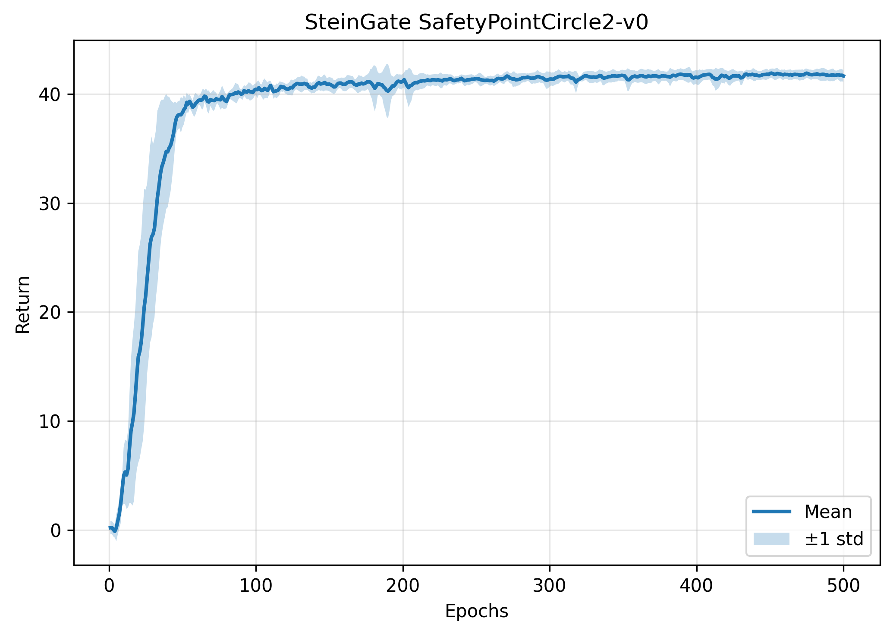
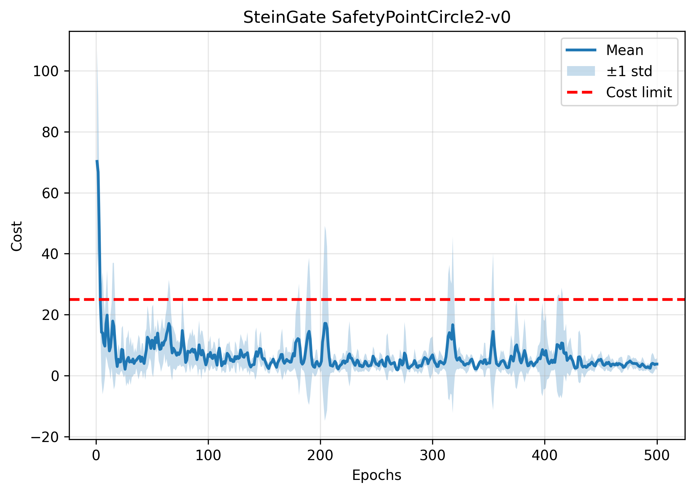
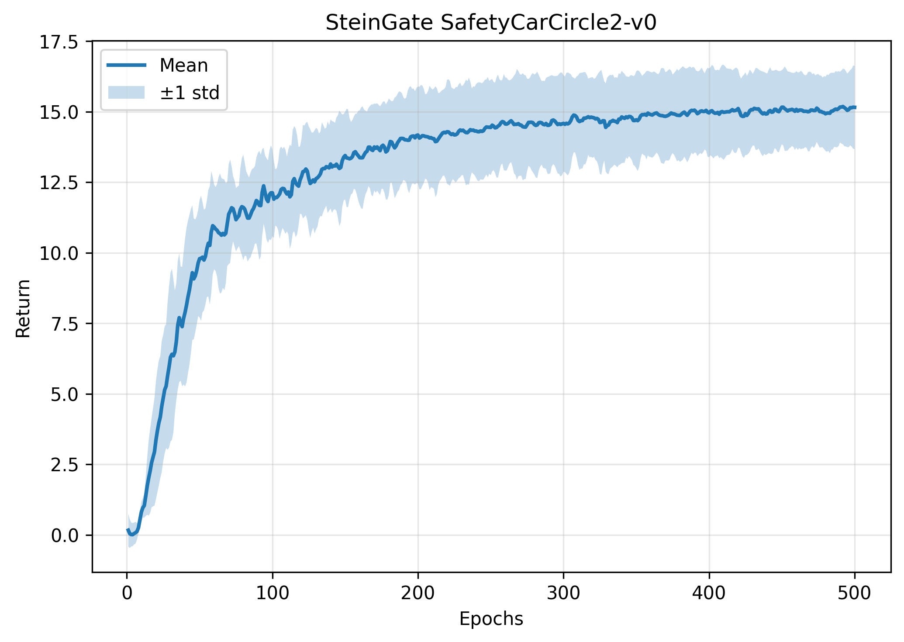
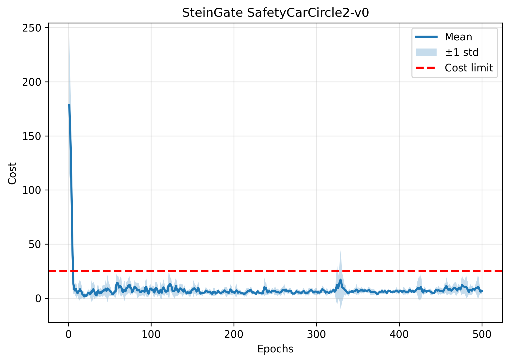
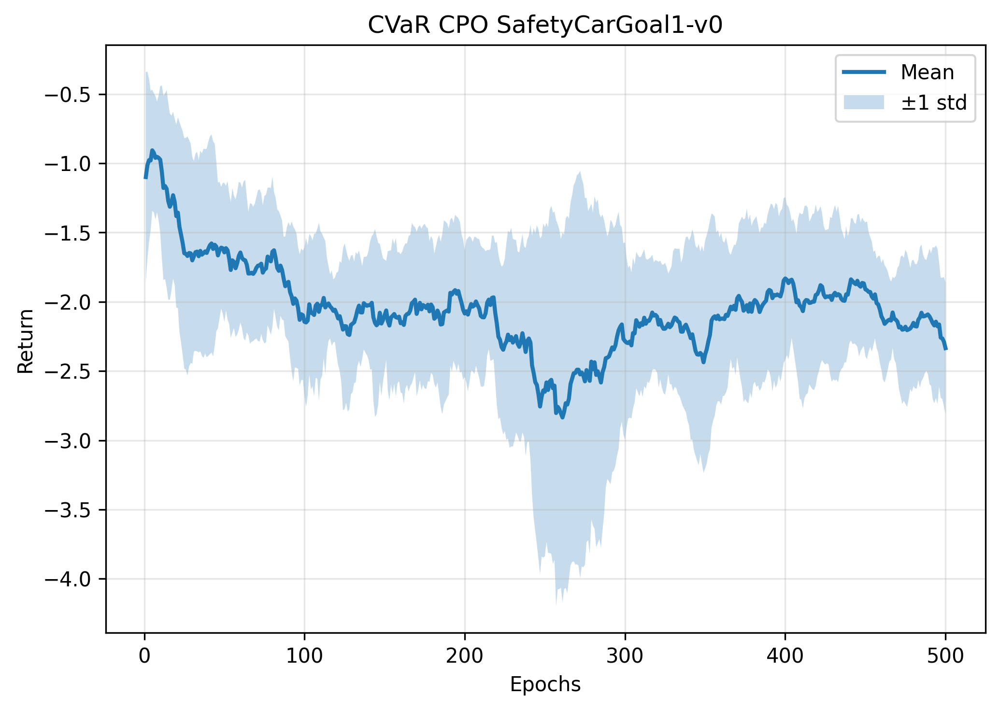
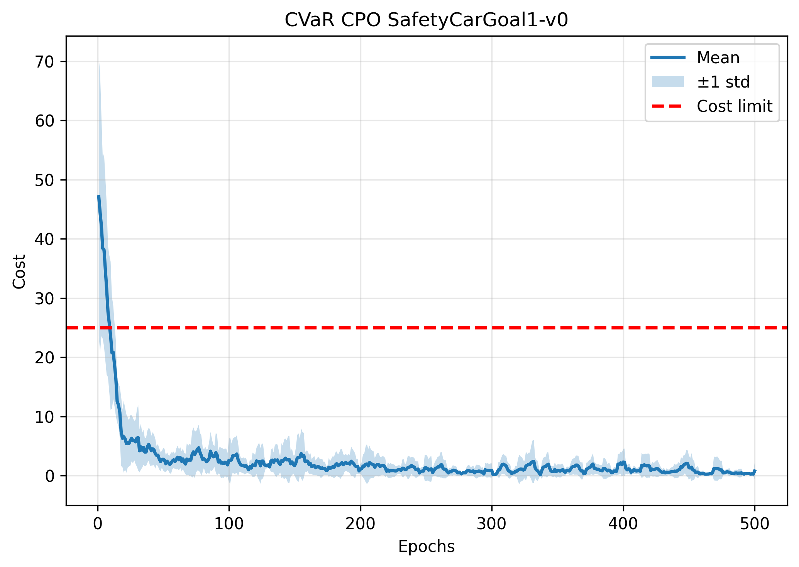
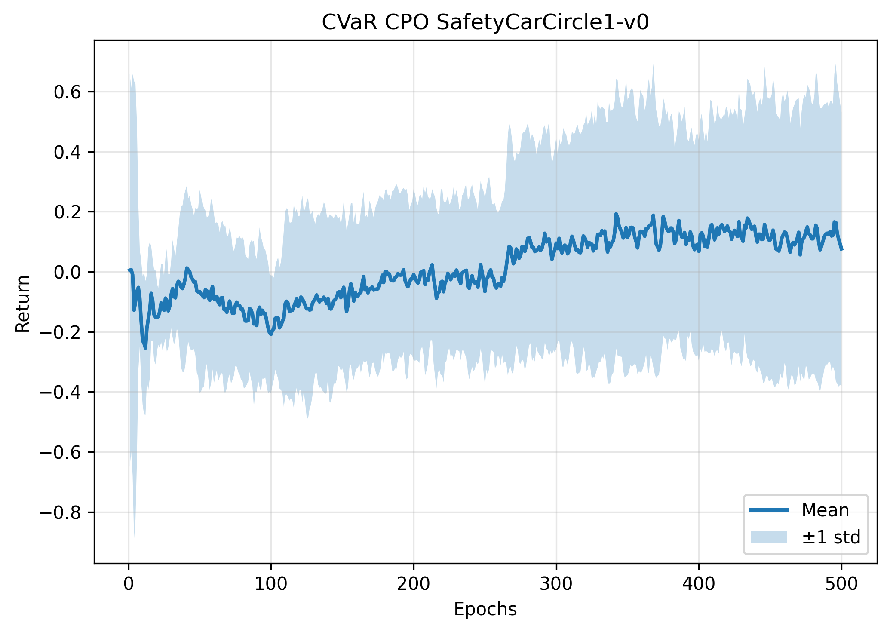
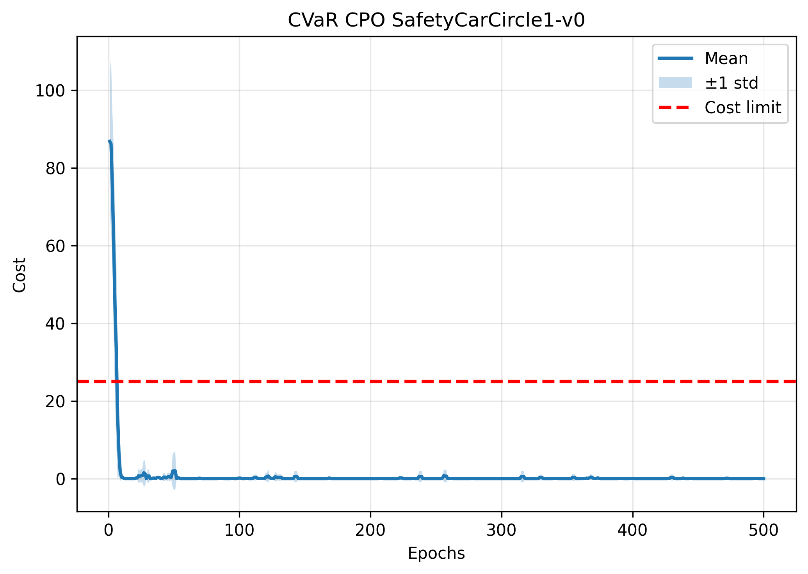

# Additional Results: SteinGate & CVaR-CPO

## SteinGate on v2 Environments

### PointCircle2-v0

---

### CarCircle2-v0

---

## CVaR-CPO on v1 Environments

### CarGoal1-v0

---

### CarCircle1-v0

---

## Notes

- All curves are averaged over 6 random seeds.
- Shaded regions indicate standard deviation.
